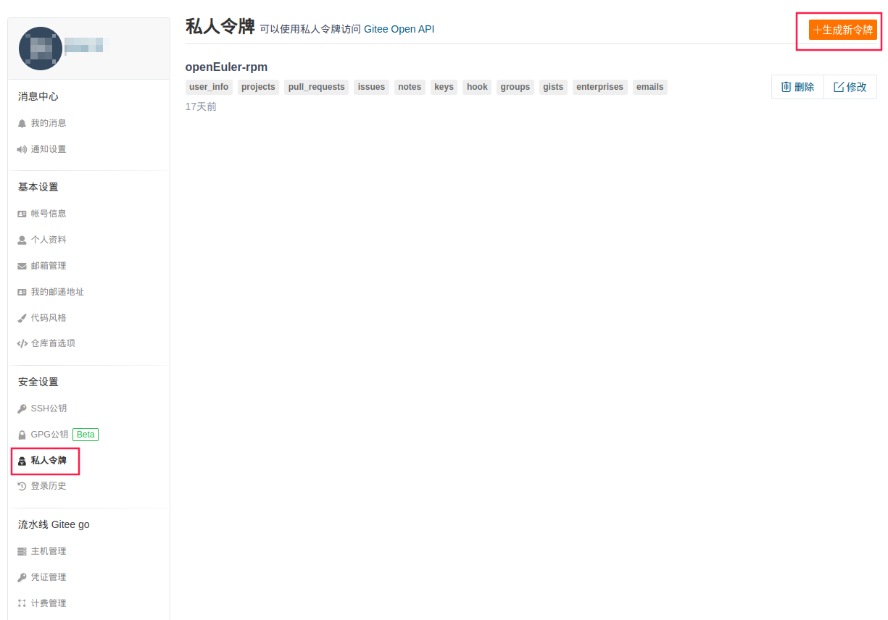
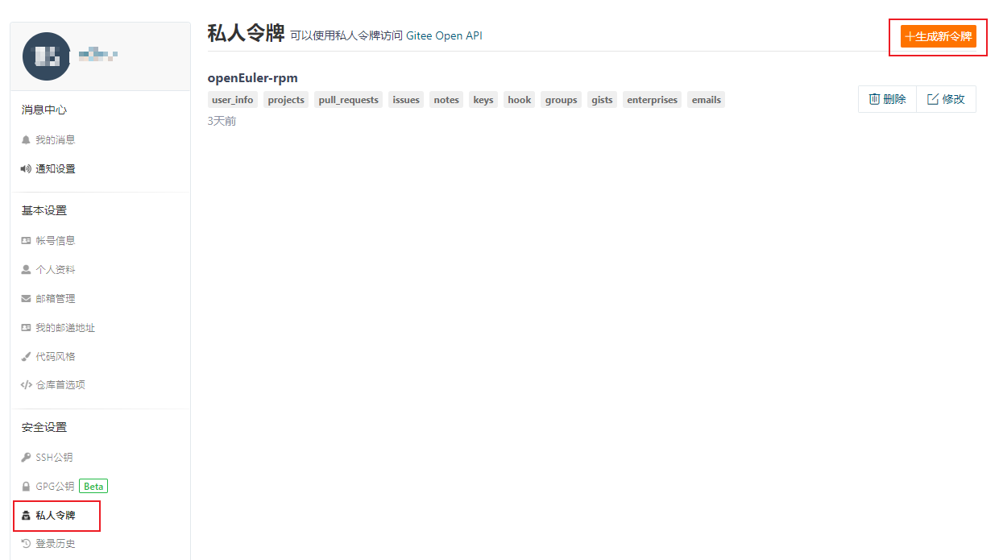
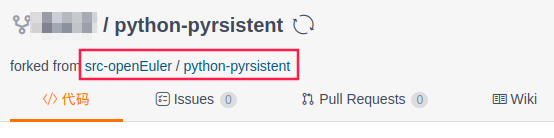
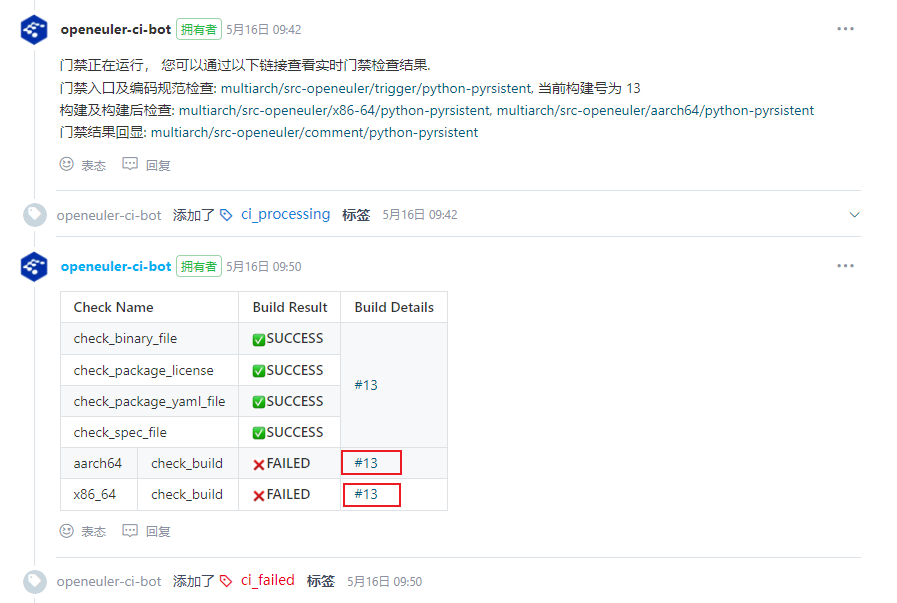
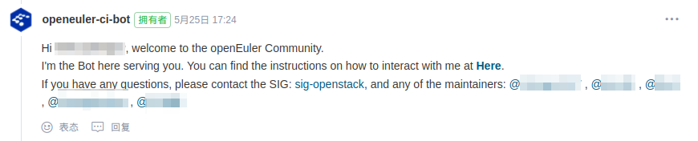
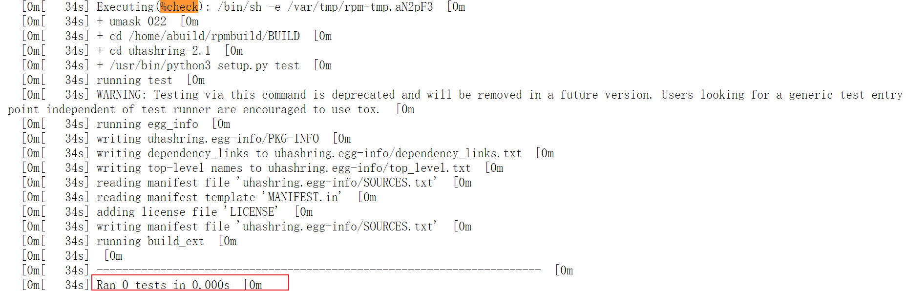

# SIG RPM Packaging Workflow Overview

The OpenStack SIG has an ongoing effort in packaging and maintaining RPM software packages for various OpenStack releases. To help new SIG developers quickly understand the SIG packaging workflow, this document provides an overview of the process for reference.

## Spreadsheet Description

During packaging, the SIG organizes packages that need to be handled in a shared spreadsheet for collaborative processing by developers. The current spreadsheet format is as follows:

| Project Name | openEuler Repo | SIG | Repo version | Required (Min) Version | lt Version | ne Version | Upper Version | Status | Requires | Depth | Author | PR link | PR status |
|:------------:|:--------------:|:---:|:------------:|:----------------------:|:----------:|:----------:|:-------------:|:------:|:--------:|:-----:|:------:|:---------:|
| pyrsistent| python-pyrsistent | sig-python-modules | 0.18.0 | 0.18.1 | | [] | 0.18.1 | Need Upgrade | [] | 13 |  |  |  |
| ... | | | | | | | | | | | | | | | |

The "Project Name" column is the software project name. The "openEuler Repo" column is the repository name of this project on the openEuler gitee, which is also the package name of this project in the openEuler system. All openEuler package repositories are hosted at <https://atomgit.com/src-openeuler>. The "SIG" column records which SIG the package belongs to.

When processing, first check the "Status" column, which indicates the package status. There are 6 package statuses in total, and developers need to handle them accordingly based on the "Status".

1. "OK": The current version is directly usable, no processing needed.
2. "Need Create Repo": This package does not exist in the openEuler system, and a new repository needs to be created in the src-openeuler repo on Gitee. For the process, refer to the community guide: [New Package](https://atomgit.com/openeuler/community/blob/master/zh/contributors/create-package.md). After creating and initializing the repository, place the package in the required OBS project.
3. "Need Create Branch": The required branch does not exist in the repository, and the developer needs to create and initialize it.
4. "Need Init Branch": The branch needs to be initialized and the branch's packages placed in the required OBS project. This indicates the branch exists but contains no source package versions of any kind. The developer needs to initialize this branch by uploading the required version source packages and spec files. Taking the adaptation of the Yoga version in the 22.09 development cycle as an example, this task works directly on the master branch. The project status of get_gitee_project_version is "Need Init Branch", and the master branch of its corresponding "python-neutron-tempest-plugin" repository, before processing, only contains README.md and README.en.md files, which needs to be initialized by the developer.
5. "Need Downgrade": Downgrade the package. This should be handled later, and operations should be confirmed with the SIG first.
6. "Need Upgrade": Upgrade the package.

After determining the corresponding processing type for the package, you need to process it based on version information. The "Repo version" column is the current version of the package in the corresponding branch of the repository. "Required (Min) Version" is the minimum version required. If it is followed by a "(Must)" indicator, it means this version must be used. "Upper Version" is the highest version that can be used. If "Required (Min) Version" and "Upper Version" are different, "Required (Min) Version" should be preferred. For example, when upgrading a package, prefer upgrading to the "Required (Min) Version".

The "Requires" column lists the dependencies of the package. The "Depth" column indicates the dependency level of the package. A "Depth" of 1 means it is a dependency of a package with "Depth" 0, and so on - packages with higher "Depth" are dependencies of packages with lower "Depth". When processing, packages with higher "Depth" should be prioritized. However, if a package has no dependencies ("Requires" is []), it can also be processed directly. If certain packages need to be processed first, their "Requires" should be used to prioritize processing their dependencies.

When processing a package, you should first note your name in the "Author" column to tell other developers that this package is already being handled. After submitting a PR (pull request), paste the PR link to the "PR link" column. After the PR is merged, mark "Done" in the "PR status" column.

## SIG Package Issue Handling Workflow

Currently, the SIG primarily uses the oos tool developed by the SIG itself to handle packaging issues. For details about the oos tool, refer to the [oos README](https://atomgit.com/openeuler/openstack/blob/master/tools/oos/README.md). For different "Status" values, the oos tool has corresponding implementations for operations such as "upgrade", "initialize branch", "place package in OBS project", etc.

Taking the upgrade of the python-pyrsistent package for the Yoga version as an example, the packaging workflow is demonstrated to help developers become familiar with the OpenStack SIG packaging-related workflow based on the oos tool. After understanding the basic workflow, developers can refer to the [oos README](https://atomgit.com/openeuler/openstack/blob/master/tools/oos/README.md) for additional operations. The python-pyrsistent package information is shown in the spreadsheet above. This package needs to be upgraded from version 0.18.0 to version 0.18.1. The Yoga version is in the 22.09 version development planning, and the current date is May 2022, so it can be submitted directly to the master branch.

### Signing the CLA

Contributing to the openEuler community requires signing the [CLA](https://clasign.osinfra.cn/sign/Z2l0ZXR1b3M5c2V9PcRU=).

For developers participating in the openEuler community for the first time, you can first review the [openEuler Contribution Guide](https://www.openeuler.org/zh/community/contribution/) for an overview of the overall contribution process.

### Environment Preparation

```shell
dnf install rpm-build rpmdevtools git

# Generate the ~/rpmbuild directory, which is also the default working path for oos
rpmdev-setuptree

pip install openstack-sig-tool==1.0.6
```

Note: The openstack-sig-tool version 1.1.0 [refactored](https://atomgit.com/openeuler/openstack/commit/9083ba741acdea4d986cb2a58069156693832d09) the `oos spec` command. The following workflow involving the `oos spec` command corresponds to version 1.0.6. It is recommended to install the newer version of [oos](https://atomgit.com/openeuler/openstack/tree/master/tools/oos), and refer to the corresponding [README](https://atomgit.com/openeuler/openstack/blob/master/tools/oos/README.md) for usage.

### Generate a Personal Access Token (PAT) for Your Gitee Account

First, enter the "Settings" interface of your Gitee account.



Select "Personal Access Token", then click "Generate New Token". After generation, save your personal access token (pat) separately - it cannot be viewed again on Gitee once generated, and if lost, it can only be regenerated.



### Generate the Spec for the python-pyrsistent Package and Submit

```shell
export GITEE_PAT=<your gitee pat>
oos spec push --name python-pyrsistent --version 0.18.1 -dp

-dp, --do-push
    [Optional] Specifies whether to execute push to the gitee repository and submit a PR. If not specified, it will only commit to the local repository.
```

Note that the `--name` parameter here corresponds to the "Project Name" column in the spreadsheet.

The `oos spec push` command automatically performs the following workflow:

1. Fork the repository corresponding to `--name` to the gitee account of the pat.
2. Clone the repository locally, with the default path being `~/rpmbuild/src-repos`.
3. Download the source package based on `--name` and `--version`, and generate the spec file (reading the existing changelog from the repository). The default path for this stage is `~/rpmbuild`.
4. Run an RPM package build locally. After passing the local build, it will automatically update the spec file and source package to the git repository. If the `-dp` parameter is included, it will automatically perform push and create PR operations. If the local build fails, the process will stop.

If the local build fails, you can modify the generated spec file. Then execute:

```shell
oos spec push --name python-pyrsistent --version 0.18.1 -dp -rs

-rs, --reuse-spec
    [Optional] Reuse the existing spec file without regenerating it.
```

Repeat this loop until the upload succeeds.

Note 1: When upgrading, use the `oos spec push` command to generate the spec file; do not use the `oos spec build` command. The push command preserves the existing changelog in the repository's spec, while the build command generates a new changelog from scratch.

Note 2: When handling errors, you can refer to the existing spec file in the repository. Since the current spec, apart from the changelog section, is regenerated by the oos tool, errors encountered by predecessors may still occur here. You can refer to predecessors' resolution approaches for these issues.

Note 3: The oos command also supports batch processing. You can refer to the oos [README](https://atomgit.com/openeuler/openstack/blob/master/tools/oos/README.md) to try it out on your own.

### PR Gate Check

At this point, you can see the forked repository in your own gitee account. Enter the repository in your account, and you can navigate to the original repository by clicking the highlighted area shown below:



In the original repository, you can see the automatically submitted PR. In the PR, you can see comments from openeuler-ci-bot:



For code hosted on gitee by openEuler, submitting a PR will automatically trigger a gate check. A local build that passed may still fail the gate check. For example, in the screenshot above, this submission failed the build. You can click the highlighted area to view the build details for the corresponding architecture.

At this point, you can modify the local spec file based on the error messages in the build details logs, and then execute again:

```shell
oos spec push --name python-pyrsistent --version 0.18.1 -dp -rs
```

The online tests will be automatically re-executed.

For detailed information about gate checks and the meaning of each result, refer to the community's [Gate Check Function Guide](https://www.openeuler.org/zh/blog/zhengyaohui/2022-03-21-ci_guild.html).

### PR Review

Once a PR passes the gate check, it needs to be reviewed by the maintainer of the software repository to which the SIG belongs. To accelerate the process, after the gate check passes, you can manually @ the corresponding maintainer to request their help with the review. After the PR is submitted, openeuler-ci-bot will post a comment as shown in the screenshot below, and the person being @'d is the maintainer of the SIG to which the current repository belongs.



## Notes

This section records some special issues that may be encountered.

### Test Not Executing Issue

In the spec file auto-generated by oos, the %check section defaults to `%{__python3} setup.py test`. However, in some packages, this does not actually execute tests, but the gate check result still shows as passed. Developers need to manually verify this. Reference methods are as follows:

1. If there is an existing spec file, you can refer to how the %check section was written in the previous spec. If the previous version did not use `%{__python3} setup.py test`, special attention is needed.
2. Enter the build details of the gate check (see the "PR Gate Check" section above), and check the %check section in the build logs. The screenshot below shows the log display after entering the build details and selecting "view in text mode". You can see that the actual number of tests run is shown as 0.



### Package Name Inconsistency Issue

A small number of packages may encounter an issue where the package name used in the auto-generated spec by oos is inconsistent with the existing package name. For example, one uses `-`, while the other uses an underscore `_`. In this case, the original package name should be used without modifying the original package name.

As a temporary workaround, developers can manually change the relevant parts of the spec file to the original package name. At the same time, oos has a mapping correction feature. Developers can submit an issue, and the SIG will fix it in oos.
