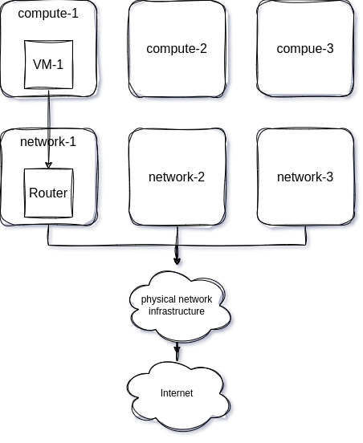
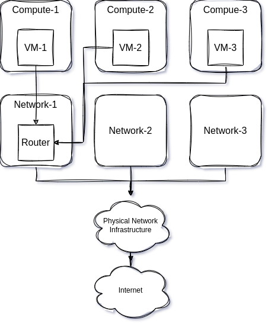
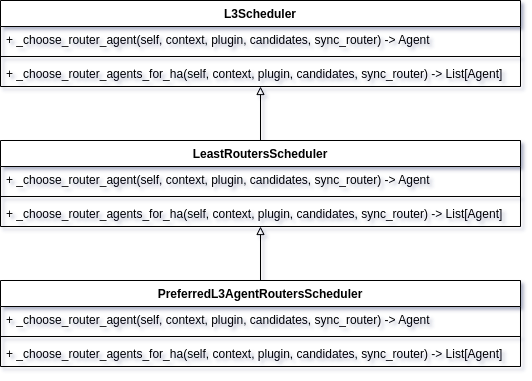
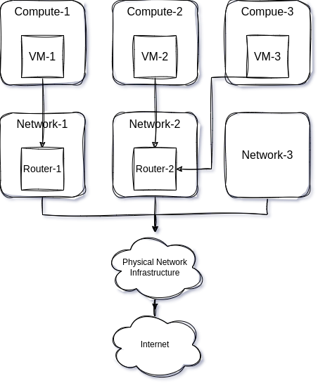

# Distributed Traffic

## Overview

OpenStack provides computing and network services to users. Users can create virtual machines and connect to a Router to access external networks, and can also enable floating IP port mapping to allow devices on external networks to access services inside virtual machines. However, as the number of virtual machines and floating IP port mappings increases, the pressure on network nodes also increases, making it necessary to find ways to distribute network node traffic and relieve network node pressure. This solution implements distributed network node traffic in the OpenStack environment, ensuring compatibility with L3 HA and DVR while minimizing network resource usage.

## Background

The basic flow for users to create virtual machines and connect to a Router is as follows:

1. Users create internal and external networks in advance.
2. When creating a Router, specify the External Gateway as the pre-created external network.
3. Connect the Router to the created internal network.
4. When creating a virtual machine instance, specify the internal network.
5. Create a floating IP using the external network.
6. Enable floating IP port mapping for the virtual machine instance.

After the above operations, the virtual machine instances created by users can access external networks, and devices on external networks can access services inside virtual machine instances according to the ports specified by the floating IP.

In a basic OpenStack environment, the traffic flow of virtual machine instances is as follows:



After users create multiple instances, virtual machine instances may be evenly distributed across compute nodes, and the traffic flow of virtual machines may be as shown in the figure below:



It can be seen that both east-west and north-south traffic of virtual machines passes through the Network-1 node, which undoubtedly increases the load on network nodes, and cannot perform well in fault recovery when network nodes fail.
Then, can multiple Routers be bound to the same subnet? In OpenStack, multiple Routers can be bound to the same subnet, but when a subnet is bound to a Router, the subnet's gateway address is bound to the Router by default. A subnet has only one gateway address, and this gateway address is also used in the DHCP service to provide the next-hop gateway address for virtual machine instances. Therefore, even if a subnet is bound to multiple Routers, the next-hop gateway address inside virtual machines will still be the subnet's gateway address, and the Router's network node selection is not controllable by users. It is inevitable that although a subnet is bound to two Routers, both Routers may be on the same network node.

To distribute traffic, OpenStack has corresponding strategies. The neutron DVR feature can be enabled, and to prevent single points of failure on network nodes, neutron L3 HA can also be enabled. However, the above methods also have their limitations.

DVR traffic distribution has significant limitations, for the following reasons:
DVR only applies to east-west traffic between virtual machine instances on different compute nodes under the same Router, and north-south traffic for virtual machines with floating IPs bound. For virtual machines accessing external networks without floating IPs bound, they still need to pass through network nodes.

In production environments, binding a floating IP to every virtual machine is impractical, but port mapping for floating IPs can be enabled so that multiple virtual machines correspond to one floating IP. However, in the current OpenStack version, regardless of whether DVR is enabled, the implementation of floating IP port mapping is done in the network namespace of network nodes.
Finally, in DVR mode, to prevent north-south traffic of virtual machines from passing through network nodes and going directly from compute nodes, a network namespace with the prefix `fip` is generated on each compute node, even if virtual machines do not have floating IPs bound. This `fip` network namespace occupies an IP address from the external network, which undoubtedly increases network resource consumption.

L3 HA also has several shortcomings. After enabling L3 HA, the Router uses keepalived to select among several network nodes. Only network nodes with keepalived status as Master will perform the actual traffic transportation tasks. Users have no control over network node selection. Although neutron provides a default Router scheduling policy, which is the fewest Routers, Routers will be scheduled to network nodes with the fewest Routers. Moreover, the keepalived mode enabled at the bottom layer is non-preemptive. That is, when the VIP drifts, even if the primary server recovers, it will not automatically reclaim resources from the backup server, which further increases uncertainty about the network nodes actually running Routers.

In summary, existing technical solutions cannot achieve true traffic distribution. Even after enabling DVR, there will be additional network resource consumption on one hand, and due to the uncertainty of Router network nodes, north-south traffic of virtual machines cannot be well distributed.

## Problems to Solve

Implement network distribution in DVR mode, L3 HA mode, and Legacy mode. The following technical issues must be resolved first:

1. Routers can specify network nodes, regardless of whether L3 HA is enabled.
2. When multiple Routers are bound to the same subnet, the DHCP service can provide different routing methods for virtual machines on different compute nodes.
3. When users use port mapping, the Router's External Gateway IP address can be used as the external network address.

## Implementation Plan

### Solving the Issue of Specifying L3 Agent

First, modify the underlying database of the Router by adding a configurations field to store Router-related configuration information. The format of configurations is as follows:

```json
{
  "configurations": {
    "preferred_agent": "network-1"
  }
}
```

When L3 HA is not enabled, the preferred_agent field is used to specify the network node where the Router is located.
When L3 HA is enabled, the format of configurations is as follows:

```json
{
  "configurations": {
    "slave_agents": [
      "compute-1"
    ],
    "master_agent": "network-1"
  }
}
```

master_agent is used to specify the network node with the Master role, and slave_agents is used to specify an array of network nodes with the Slave role.

Then, the Router creation logic needs to be modified. A new scheduling method needs to be added for Routers. In Neutron, router_scheduler_driver defaults to LeastRoutersScheduler (network node with the fewest Routers). By inheriting this class and adding a new scheduling method, specified network nodes can be selected based on the Router's configurations field.



Finally, the Router update logic code of neutron-l3-agent needs to be modified. When neutron-l3-agent starts, it initializes a resource queue for updating resource status and starts a daemon thread for reading the resource queue. Whenever there is a change in network resource status (create, delete, or update), it is added to the queue. Finally, actions to be executed are determined based on the resource type and status.
Here, after the Router is created, neutron-l3-agent will finally execute the _process_added_router method, first calling the initialize method of RouterInfo, then calling the process method.
The initialize method mainly involves initialization of Router information, including creation of network namespaces, creation of ports, initialization of keepalived processes, etc.
The process method performs the following operations:

1. Set the internal Port for connecting to internal networks;
2. Set the external Port for connecting to external networks;
3. Update routing tables;
4. For Routers with L3 HA enabled, set the HA Port and start the keepalived process.
5. For Routers with DVR enabled, also set the Port in the fip namespace.

Here, only the case where L3 HA is enabled needs to be considered because when L3 HA is not enabled, after neutron-server creates the Router, the RPC call is sent directly to the neutron-l3-agent service on the specified network node through the new scheduling method. When L3 HA is enabled, the scheduling method selects master and slave network nodes, and RPC calls are sent to neutron-l3-agent services on these network nodes.
neutron-l3-agent starts a keepalived process for each Router for L3 HA, so the keepalived startup logic needs to be modified during keepalived initialization. Using the information from the configurations field, obtain master and slave network nodes, and compare with current network node information to determine the network node's role. Finally, because master and slave nodes are specified, to avoid the situation where after the master network node recovers from a crash, the VIP is still on the slave node, the keepalived mode needs to be changed to preemptive mode.

### Solving Routing Issues

Solve the routing issue for virtual machine instances after multiple Routers are bound to the same subnet. DHCP protocol functionality includes not only DNS server assignment but also gateway address assignment, meaning routing information can be passed to virtual machine instances through the DHCP protocol. In OpenStack, DHCP for virtual machine instances is provided by neutron-dhcp-agent, and the core functionality of neutron-dhcp-agent is basically completed by dnsmasq.

dnsmasq provides tag labels, which can add tags to specified IP addresses, and then configurations can be issued based on tags.
The dnsmasq host configuration file is as follows:

```bash
fa:16:3e:28:a5:0a,host-172-16-0-1.openstacklocal,172.16.0.1,set:subnet-6a4db541-e563-43ff-891b-aa8c05c988c5
fa:16:3e:2b:dd:88,host-172-16-0-10.openstacklocal,172.16.0.10,set:subnet-6a4db541-e563-43ff-891b-aa8c05c988c5
fa:16:3e:a1:96:fc,host-172-16-0-207.openstacklocal,172.16.0.207,set:compute-1-subnet-6a4db541-e563-43ff-891b-aa8c05c988c5
fa:16:3e:45:b4:1a,host-172-16-10-1.openstacklocal,172.16.10.1,set:subnet-faeec4d1-2c0c-4f7a-bc9b-0af562694902
```

The dnsmasq option configuration file is as follows:

```bash
tag:subnet-faeec4d1-2c0c-4f7a-bc9b-0af562694902,option:dns-server,8.8.8.8
tag:subnet-faeec4d1-2c0c-4f7a-bc9b-0af562694902,option:classless-static-route,172.16.0.0/24,0.0.0.0,169.254.169.254/32,172.16.0.2,0.0.0.0/0,172.16.0.1
tag:subnet-faeec4d1-2c0c-4f7a-bc9b-0af562694902,249,172.16.0.0/24,0.0.0.0,169.254.169.254/32,172.16.0.2,0.0.0.0/0,172.16.0.1
tag:subnet-faeec4d1-2c0c-4f7a-bc9b-0af562694902,option:router,172.16.0.1
tag:compute-1-subnet-6a4db541-e563-43ff-891b-aa8c05c988c5,option:classless-static-route,172.16.10.0/24,0.0.0.0,169.254.169.254/32,172.16.0.2,0.0.0.0/0,172.16.0.10
tag:compute-1-subnet-6a4db541-e563-43ff-891b-aa8c05c988c5,249,172.16.0.0/24,0.0.0.0,169.254.169.254/32,172.16.0.2,0.0.0.0/0,172.16.0.10
tag:compute-1-subnet-6a4db541-e563-43ff-891b-aa8c05c988c5,option:router,172.16.0.10
```

It can be seen that IP 172.16.0.207 has been tagged with a compute-1 prefix. After matching the option file, the default route gateway address for the virtual machine at 172.16.0.207 will change from 172.16.0.1 to 172.16.0.10. Of course, the prerequisite for all this is that the subnet needs to be bound to multiple Routers.
At the same time, provide neutron-dhcp-agent with configuration items that can be modified by administrators to specify the relationship between compute nodes and network nodes. This can be one-to-one or many-to-one.

### Solving the Router Gateway Port Forwarding Issue

Change port mapping based on floating IPs to a method based on the Router's External Gateway. There are two reasons:

1. Port mapping based on floating IPs will occupy an additional external network IP for users who originally need to use the Router's External Gateway. To reduce external network IP usage, the External Gateway method is used for port mapping.
2. Port mapping based on floating IPs relies on the Router's network namespace for NAT. When L3 HA is not enabled, after multiple Routers are bound to the same subnet, due to the logic of port mapping creation, NAT occurs in the network namespace of the Router where the subnet gateway address is located (specific network node), rather than being distributed in the network namespaces of various Routers (each network node). This increases the pressure on network nodes during port mapping.
The implementation method is similar to port mapping based on floating IPs, except that External Gateway does not need to select a Router because External Gateway is inherently associated with the Router. Port mapping based on floating IPs selects the Router where the subnet's gateway address is located.

Finally, after implementing the above three parts, the steps for users to achieve traffic distribution are as follows:

1. Users modify the neutron-dhcp-agent configuration file to modify the mapping relationship between compute nodes and network nodes. For example, with three network nodes and three compute nodes, configure compute-1 to go through network-1 node, and compute-2 and compute-3 to go through network-2 node.
2. Use neutron's API to create multiple Routers and specify network nodes, and bind the Routers to the same subnet.
3. Create multiple virtual machine instances using the subnet network.

The flow of virtual machine instance network traffic is shown in the figure below:



It can be seen that VM-1 accessing external networks passes through network-1 node, while VM-2 and VM-3 accessing external networks pass through network-2 node. At the same time, VM-1, VM-2, and VM-3 are under the same subnet and can access each other.

# API

## List Router Gateway Port Forwardings

```text
GET /v2.0/routers/{router_id}/gateway_port_forwardings

Response
{
  "gateway_port_forwardings": [
    {
      "id": "67a70b09-f9e7-441e-bd49-7177fe70bb47",
      "external_port": 34203,
      "protocol": "tcp",
      "internal_port_id": "b671c61a-95c3-49cd-89f2-b7e817d1f486",
      "internal_ip_address": "172.16.0.196",
      "internal_port": 518,
      "gw_ip_address": "192.168.57.234"
    }
  ]
}
```

## Show Router Gateway Port Forwarding

```text
GET /v2.0/routers/{router_id}/gateway_port_forwardings/{port_forwarding_id}

Response
{
  "gateway_port_forwarding": {
    "id": "67a70b09-f9e7-441e-bd49-7177fe70bb47",
    "external_port": 34203,
    "protocol": "tcp",
    "internal_port_id": "b671c61a-95c3-49cd-89f2-b7e817d1f486",
    "internal_ip_address": "172.16.0.196",
    "internal_port": 518,
    "gw_ip_address": "192.168.57.234"
  }
}
```

## Create Router Gateway Port Forwarding

```text
POST /v2.0/routers/{router_id}/gateway_port_forwardings
Request Body
{
  "gateway_port_forwarding": {
    "external_port": int,
    "internal_port": int,
    "internal_ip_address": "string",
    "protocol": "tcp",
    "internal_port_id": "string"
  }
}

Response
{
  "gateway_port_forwarding": {
    "id": "da554833-b756-4626-9900-6256c361f94b",
    "external_port": 14122,
    "protocol": "tcp",
    "internal_port_id": "b671c61a-95c3-49cd-89f2-b7e817d1f486",
    "internal_ip_address": "172.16.0.196",
    "internal_port": 3634,
    "gw_ip_address": "192.168.57.234"
  }
}
```

## Update Router Gateway Port Forwarding

```text
PUT /v2.0/routers/{router_id}/gateway_port_forwardings/{port_forwarding_id}
Request Body
{
  "gateway_port_forwarding": {
    "external_port": int,
    "internal_port": int,
    "internal_ip_address": "string",
    "protocol": "tcp",
    "internal_port_id": "string"
  }
}

Response
{
  "gateway_port_forwarding": {
    "id": "da554833-b756-4626-9900-6256c361f94b",
    "external_port": 14122,
    "protocol": "tcp",
    "internal_port_id": "b671c61a-95c3-49cd-89f2-b7e817d1f486",
    "internal_ip_address": "172.16.0.196",
    "internal_port": 3634,
    "gw_ip_address": "192.168.57.234"
  }
}
```

## Delete Router Gateway Port Forwarding

```text
DELETE /v2.0/routers/{router_id}/gateway_port_forwardings/{port_forwarding_id}
```

## Create Router

```text
POST /v2.0/routers
Request Body
{
    "router": {
        "name": "string",
        "admin_state_up": true,
        "configurations": {
            "preferred_agent": "string",
            "master_agent": "string",
            "slave_agents": [
                "string"
            ]
        }
    }
}
```

## Update Router

```text
PUT /v2.0/routers/{router_id}
Request Body
{
  "router": {
    "name": "string",
    "admin_state_up": true,
    "configurations": {
      "preferred_agent": "string",
      "master_agent": "control01",
      "slave_agents": [
        "control01"
      ]
    }
  }
}
```

# Development Schedule

* 2023-07-28 to 2023-08-30: Complete development
* 2023-09-01 to 2023-11-15: Testing and bug fixes
* 2023-11-30: Introduce openEuler 20.03 LTS SP4 version
* 2023-12-30: Introduce openEuler 22.03 LTS SP3 version
